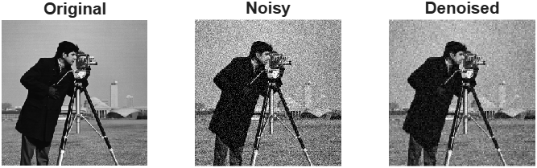
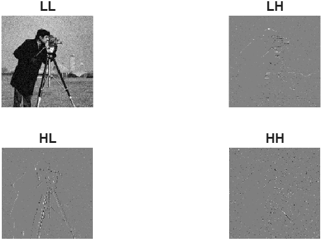

# Image Denoising using 2D DWT

## Description
This project removes noise from images using Discrete Wavelet Transform (DWT).

## Steps
- Convert image to grayscale
- Add noise
- Apply DWT (LL, LH, HL, HH)
- Apply thresholding
- Reconstruct image

## Output

### Result

### Subbands

## Tool Used
MATLAB Online

## Concept
Noise is mainly present in high-frequency components. By reducing LH, HL, HH, we get a clean image.
